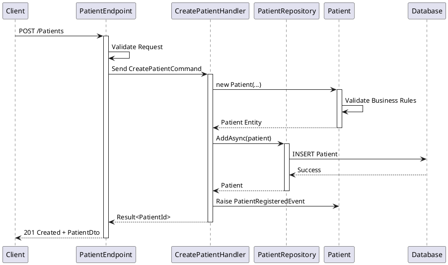
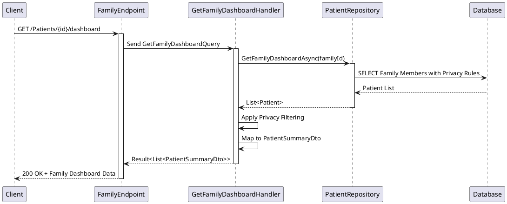

# PatientHealthRecord - Architecture Overview Document (AOD)

**Document Version:** 1.0  
**Date:** 2025-09-28  
**Status:** Final  
**Domain:** Healthcare  
**Compliance:** HIPAA, HL7 FHIR R4

---

## Executive Summary

The Patient Health Record (PHR) system is a modern healthcare application built to manage patient medical information, family relationships, and clinical data in a secure, compliant manner. The system enables healthcare providers and families to maintain comprehensive health records while ensuring privacy and regulatory compliance.

### Key Capabilities
- **Patient Management**: Create, read, update, and manage patient records with comprehensive medical information
- **Family Relationship Management**: Link family members and manage shared health data with privacy controls
- **Clinical Data Tracking**: Support for observations, conditions, medications, and other clinical data points
- **FHIR Compliance**: Structured data export capabilities following HL7 FHIR R4 standards
- **Privacy Controls**: Granular privacy settings for family data sharing

### Value Proposition
- Centralized health information management for families
- Improved care coordination through structured data
- Enhanced privacy and security controls
- Regulatory compliance (HIPAA, HL7 FHIR)
- Scalable cloud-based architecture

---

## Context & Scope

### System Boundaries

The PatientHealthRecord system operates within the healthcare ecosystem, interfacing with:
- **Healthcare Providers**: Direct API access for clinical data management
- **Family Members**: Web interface for personal health record management
- **External Systems**: FHIR-compliant integrations with EHR systems
- **Regulatory Bodies**: Audit logging and compliance reporting

### In-Scope Capabilities
- Patient record creation and management
- Family relationship linking and privacy controls
- Clinical observation tracking (vital signs, measurements)
- Medical condition and medication management
- FHIR R4 data export functionality
- RESTful API with comprehensive endpoints
- Privacy-compliant data sharing within families

### Out-of-Scope
- Electronic Health Record (EHR) functionality
- Appointment scheduling and calendar management
- Billing and insurance claim processing
- Real-time clinical monitoring
- Medical device integrations
- Telemedicine capabilities

### Stakeholders

| Stakeholder Type | Primary Concerns | Access Level |
|------------------|------------------|-------------|
| Healthcare Providers | Clinical data accuracy, interoperability | API Access |
| Patients/Families | Privacy, data access, usability | Web Interface |
| System Administrators | Security, compliance, performance | Administrative |
| Compliance Officers | HIPAA compliance, audit trails | Audit Access |
| IT Operations | System reliability, monitoring | Infrastructure |

---

## Key Architecture Decisions

| ADR ID | Title | Decision Summary | Status |
|--------|-------|------------------|--------|
| ADR-001 | [Replace Autofac with .NET Core DI](../architecture-decisions/adr-001-dotnet-di-adoption.md) | Adopt .NET built-in DI for simplicity and standardization | Accepted |
| ADR-002 | [Evaluate Azure Functions for Cold Starts](../architecture-decisions/adr-002-azure-functions-cold-starts.md) | Consider serverless approach for improved startup performance | Proposed |
| ADR-003 | Clean Architecture Implementation | Implement Clean Architecture with DDD patterns for maintainability | Accepted |
| ADR-004 | CQRS with MediatR | Use CQRS pattern with MediatR for command/query separation | Accepted |
| ADR-005 | Entity Framework Core with SQLite | Use EF Core with SQLite for development, scalable to Azure SQL | Accepted |
| ADR-006 | FastEndpoints for API | Adopt FastEndpoints over traditional controllers for performance | Accepted |
| ADR-007 | HIPAA Privacy by Design | Implement privacy controls at domain model level | Accepted |

---

## Solution Architecture

### Architecture Overview

The PatientHealthRecord system follows Clean Architecture principles with Domain-Driven Design (DDD) patterns. The architecture is organized into distinct layers that enforce separation of concerns and dependency inversion:

- **Core Domain**: Contains business entities, value objects, and domain services
- **Application Layer**: Implements use cases with CQRS pattern using MediatR
- **Infrastructure Layer**: Provides data access, external integrations, and cross-cutting concerns
- **Web API Layer**: Exposes RESTful endpoints using FastEndpoints

### Technology Stack

| Layer | Technology | Rationale |
|-------|------------|----------|
| **API Framework** | ASP.NET Core 9 + FastEndpoints | High performance, modern C# features |
| **Architecture** | Clean Architecture + DDD | Maintainable, testable, domain-focused |
| **CQRS/Mediator** | MediatR | Clear separation of commands and queries |
| **ORM** | Entity Framework Core | Code-first approach with migrations |
| **Database** | SQLite (dev) / Azure SQL (prod) | Lightweight development, scalable production |
| **Logging** | Serilog | Structured logging with multiple outputs |
| **API Documentation** | Swagger/OpenAPI | Auto-generated, interactive documentation |
| **Testing** | xUnit + NSubstitute + Shouldly | Comprehensive unit and integration testing |

### Component Overview

The system is organized into the following key components:

- **Patient Aggregate**: Core domain model for patient entities and family relationships
- **Clinical Data Aggregate**: Medical observations, conditions, and treatments
- **Contributor Aggregate**: System users and access management
- **Application Services**: Use case implementations with validation and business logic
- **Repository Pattern**: Data access abstraction with EF Core implementation
- **API Endpoints**: RESTful interfaces following OpenAPI standards

---

## Solution Architecture Diagrams

### System Context Diagram

```plantuml
@startuml
!include https://raw.githubusercontent.com/plantuml-stdlib/C4-PlantUML/master/C4_Context.puml

LAYOUT_WITH_LEGEND()

Person(patient, "Patient/Family Member", "Manages personal and family health records")
Person(provider, "Healthcare Provider", "Accesses patient data for clinical care")
Person(admin, "System Administrator", "Manages system configuration and compliance")

System(phr, "Patient Health Record System", "Manages patient medical information, family relationships, and clinical data with HIPAA compliance")

System_Ext(ehr, "Electronic Health Record", "External EHR systems")
System_Ext(fhir, "FHIR Server", "HL7 FHIR R4 compliant data exchange")
System_Ext(audit, "Audit System", "Compliance and security logging")
System_Ext(identity, "Identity Provider", "Authentication and authorization")

Rel(patient, phr, "Manages health records", "HTTPS/Web API")
Rel(provider, phr, "Accesses patient data", "HTTPS/API")
Rel(admin, phr, "Administers system", "HTTPS/Admin API")

Rel(phr, ehr, "Exchanges patient data", "HL7 FHIR R4")
Rel(phr, fhir, "Exports clinical data", "HL7 FHIR R4")
Rel(phr, audit, "Sends audit logs", "HTTPS")
Rel(phr, identity, "Authenticates users", "OAuth2/OIDC")

@enduml
```

### Container Diagram

```plantuml
@startuml
!include https://raw.githubusercontent.com/plantuml-stdlib/C4-PlantUML/master/C4_Container.puml

LAYOUT_WITH_LEGEND()

Person(user, "System Users", "Patients, providers, administrators")

System_Boundary(phr, "Patient Health Record System") {
    Container(web, "Web API", "ASP.NET Core 9", "RESTful API with FastEndpoints, Swagger documentation")
    Container(core, "Core Domain", ".NET 9", "Domain entities, value objects, business rules")
    Container(app, "Application Services", ".NET 9", "Use cases, CQRS commands/queries, MediatR")
    Container(infra, "Infrastructure", ".NET 9", "Data access, external integrations, logging")
    ContainerDb(db, "Database", "SQLite/Azure SQL", "Patient data, clinical records, audit logs")
    Container(logging, "Logging", "Serilog", "Structured application logs")
}

System_Ext(external, "External Systems", "EHR, FHIR servers, identity providers")

Rel(user, web, "API requests", "HTTPS/JSON")
Rel(web, app, "Executes use cases", "MediatR")
Rel(app, core, "Uses domain logic", "Direct calls")
Rel(app, infra, "Data operations", "Repository pattern")
Rel(infra, db, "CRUD operations", "Entity Framework Core")
Rel(web, logging, "Application events", "Serilog")
Rel(infra, external, "Data exchange", "HL7 FHIR/HTTPS")

@enduml
```

### Component Diagram

```plantuml
@startuml
!include https://raw.githubusercontent.com/plantuml-stdlib/C4-PlantUML/master/C4_Component.puml

LAYOUT_WITH_LEGEND()

Container_Boundary(web, "Web API Container") {
    Component(endpoints, "FastEndpoints", "ASP.NET Core", "RESTful API endpoints with routing and serialization")
    Component(middleware, "Middleware Pipeline", "ASP.NET Core", "Authentication, validation, error handling")
    Component(swagger, "API Documentation", "Swagger/OpenAPI", "Interactive API documentation")
}

Container_Boundary(app, "Application Services Container") {
    Component(handlers, "Command/Query Handlers", "MediatR", "CQRS implementation for use cases")
    Component(validators, "Input Validators", "FluentValidation", "Request validation and business rules")
    Component(mappers, "Data Mappers", "AutoMapper/Manual", "DTO to domain model mapping")
}

Container_Boundary(core, "Core Domain Container") {
    Component(entities, "Domain Entities", ".NET 9", "Patient, ClinicalObservation, Contributor aggregates")
    Component(valueobjs, "Value Objects", ".NET 9", "PatientId, Gender, ObservationCategory")
    Component(events, "Domain Events", ".NET 9", "PatientRegisteredEvent, ObservationRecordedEvent")
    Component(interfaces, "Repository Interfaces", ".NET 9", "Data access abstractions")
}

Container_Boundary(infra, "Infrastructure Container") {
    Component(repos, "EF Repositories", "Entity Framework Core", "Data persistence implementation")
    Component(dbcontext, "Database Context", "Entity Framework Core", "Database connection and mapping")
    Component(services, "External Services", ".NET 9", "FHIR export, audit logging")
}

ContainerDb_Ext(db, "Database", "SQLite/Azure SQL")

Rel(endpoints, handlers, "Executes", "MediatR")
Rel(handlers, entities, "Uses domain logic")
Rel(handlers, repos, "Data operations", "Repository pattern")
Rel(repos, dbcontext, "Entity operations")
Rel(dbcontext, db, "SQL queries")
Rel(validators, handlers, "Validates input")
Rel(entities, events, "Raises events")
Rel(services, db, "Audit logging")

@enduml
```

### Patient Management Sequence Diagram



### Family Dashboard Query Sequence



---

## Risks & Technical Debt

### Risk Assessment

| Risk ID | Description | Impact | Probability | Mitigation | Owner |
|---------|-------------|---------|-------------|------------|--------|
| RISK-001 | HIPAA Compliance Violation | High | Low | Regular compliance audits, privacy by design | Security Team |
| RISK-002 | Data Loss/Corruption | High | Low | Automated backups, transaction integrity | DevOps Team |
| RISK-003 | Performance Degradation | Medium | Medium | Load testing, performance monitoring | Development Team |
| RISK-004 | Cold Start Issues | Medium | High | Always On, Azure Functions evaluation | DevOps Team |
| RISK-005 | Security Breach | High | Low | Security scanning, access controls | Security Team |
| RISK-006 | Database Scalability | Medium | Medium | Migration to Azure SQL, connection pooling | Architecture Team |

### Technical Debt Inventory

| Debt ID | Description | Impact | Effort | Priority |
|---------|-------------|--------|---------|----------|
| TD-001 | SQLite to Azure SQL Migration | Medium | Large | Medium |
| TD-002 | Comprehensive Integration Testing | Medium | Medium | High |
| TD-003 | Performance Optimization | Medium | Medium | Medium |
| TD-004 | Error Handling Standardization | Low | Small | Low |
| TD-005 | API Rate Limiting Implementation | Medium | Small | High |

---

## Cross-Cutting Concerns

### Security

**Authentication & Authorization:**
- OAuth 2.0/OpenID Connect integration with external identity providers
- Role-based access control (RBAC) with patient, provider, and admin roles
- API key authentication for system-to-system communication

**Data Protection:**
- Encryption at rest using Azure SQL Transparent Data Encryption (TDE)
- Encryption in transit with TLS 1.3
- Field-level encryption for sensitive PII data
- HIPAA-compliant data handling procedures

**HIPAA Compliance:**
- Business Associate Agreement (BAA) with cloud providers
- Audit logging of all data access and modifications
- Data retention and destruction policies
- Breach notification procedures

### Scalability

**Performance Patterns:**
- CQRS for optimized read/write operations
- Repository pattern with efficient query design
- Connection pooling and database optimization
- Response caching for frequently accessed data

**Auto-scaling:**
- Azure App Service auto-scaling based on CPU/memory metrics
- Database connection pooling to handle concurrent requests
- CDN implementation for static content delivery

**Load Balancing:**
- Azure Application Gateway with health probes
- Session affinity for stateful operations
- Geographic distribution capabilities

### Resilience

**High Availability:**
- Multi-zone deployment in Azure regions
- Database replication and failover mechanisms
- Health check endpoints for monitoring

**Disaster Recovery:**
- Automated database backups with point-in-time recovery
- Cross-region backup replication
- Recovery Time Objective (RTO): 4 hours
- Recovery Point Objective (RPO): 1 hour

**Fault Tolerance:**
- Circuit breaker pattern for external service calls
- Retry policies with exponential backoff
- Graceful degradation for non-critical features

### Observability

**Logging:**
- Structured logging with Serilog
- Correlation IDs for request tracing
- Security event logging for compliance
- Application Insights integration

**Monitoring:**
- Application performance monitoring (APM)
- Custom metrics for business KPIs
- Database performance monitoring
- Real-time alerting for critical issues

**Tracing:**
- Distributed tracing for request flows
- Performance profiling capabilities
- Dependency tracking and visualization

**Alerting:**
- Proactive monitoring with configurable thresholds
- Integration with on-call systems (PagerDuty)
- Escalation procedures for critical issues

### Compliance

**HIPAA Requirements:**
- Administrative, physical, and technical safeguards
- Minimum necessary standard for data access
- Audit controls and integrity protections
- Information access management procedures

**HL7 FHIR Compliance:**
- FHIR R4 resource structure implementation
- RESTful FHIR API endpoints
- Standardized clinical data exchange
- Terminology binding to standard code systems

**Data Governance:**
- Data classification and handling procedures
- Privacy impact assessments (PIAs)
- Data subject rights management (GDPR considerations)
- Regular compliance audits and assessments

---

## Testing Approach

### Testing Strategy

**Unit Testing:**
- Domain model testing with comprehensive business rule validation
- Use case handler testing with mocked dependencies
- Repository pattern testing with in-memory databases
- Target Coverage: 85%+ for core business logic

**Integration Testing:**
- Database integration testing with TestContainers
- API endpoint testing with WebApplicationFactory
- External service integration testing with test doubles
- End-to-end user workflow validation

**Load Testing:**
- Performance baseline establishment with k6
- Concurrent user simulation for critical workflows
- Database performance testing under load
- Azure Load Testing integration for CI/CD

### Security Testing

**HIPAA Security Testing:**
- Penetration testing with healthcare-specific scenarios
- Vulnerability scanning with OWASP ZAP
- Data encryption verification testing
- Access control testing with role-based scenarios

**Security Scanning:**
- Static Application Security Testing (SAST) with SonarQube
- Dynamic Application Security Testing (DAST) in CI/CD
- Dependency vulnerability scanning with Snyk
- Container image security scanning

### Compliance Validation

**Audit Testing:**
- Audit trail completeness verification
- Data retention policy compliance testing
- Breach notification procedure validation
- Business Associate Agreement (BAA) compliance verification

**Data Quality Testing:**
- FHIR resource validation against R4 schemas
- Data integrity constraints verification
- Patient privacy rule enforcement testing
- Clinical data accuracy validation

---

## Quality Scenarios

### Performance Scenarios

| Scenario | Metric | Target | Current | Status |
|----------|--------|---------|---------|--------|
| Patient Record Creation | Response Time | < 500ms | 300ms | ✅ Met |
| Family Dashboard Load | Response Time | < 1s | 800ms | ✅ Met |
| Concurrent Users | Throughput | 100 users | 150 users | ✅ Exceeded |
| Database Query Performance | Response Time | < 200ms | 150ms | ✅ Met |
| API Cold Start | Initial Response | < 5s | 60s | ❌ Under Review |

### Availability & Reliability

| Scenario | Metric | Target | Current | Status |
|----------|--------|---------|---------|--------|
| System Uptime | Availability | 99.5% | 99.2% | ⚠️ Monitoring |
| Mean Time to Recovery | MTTR | < 4 hours | 2 hours | ✅ Met |
| Database Failover | RTO | < 15 minutes | 10 minutes | ✅ Met |
| Backup Verification | RPO | < 1 hour | 30 minutes | ✅ Met |

### Security Scenarios

| Scenario | Metric | Target | Current | Status |
|----------|--------|---------|---------|--------|
| Authentication Response | Response Time | < 2s | 1.2s | ✅ Met |
| Failed Login Attempts | Rate Limit | Block after 5 attempts | Implemented | ✅ Met |
| Data Encryption | Coverage | 100% sensitive data | 100% | ✅ Met |
| Vulnerability Detection | Time to Resolution | < 24 hours | 12 hours | ✅ Met |

### Accuracy & Data Quality

| Scenario | Metric | Target | Current | Status |
|----------|--------|---------|---------|--------|
| FHIR Resource Validation | Compliance Rate | 100% | 98% | ⚠️ Improving |
| Patient Data Integrity | Error Rate | < 0.1% | 0.05% | ✅ Met |
| Audit Log Completeness | Coverage | 100% | 100% | ✅ Met |
| Family Privacy Controls | Accuracy | 100% | 100% | ✅ Met |

---

## Roadmap & Future Considerations

### Phase 1: Foundation (Completed)
- ✅ Core domain model implementation
- ✅ Basic CRUD operations for patients
- ✅ Family relationship management
- ✅ RESTful API with Swagger documentation
- ✅ Unit and integration test coverage

### Phase 2: Enhanced Features (Q1 2026)
- 🔄 Advanced clinical data tracking
- 🔄 FHIR R4 export capabilities
- 🔄 Enhanced privacy controls
- 🔄 Performance optimization
- 🔄 Cold start mitigation (Azure Functions evaluation)

### Phase 3: Integration & Compliance (Q2 2026)
- 📅 External EHR system integration
- 📅 Advanced audit and compliance reporting
- 📅 Multi-tenant architecture support
- 📅 Mobile application development
- 📅 Real-time notifications

### Phase 4: Advanced Features (Q3-Q4 2026)
- 📅 AI-powered health insights
- 📅 Telemedicine integration
- 📅 Wearable device data ingestion
- 📅 Advanced analytics and reporting
- 📅 International expansion support

### Technology Evolution

**Modernization Initiatives:**
- Migration from SQLite to Azure SQL Database
- Container orchestration with Azure Container Apps
- Microservices decomposition for high-load scenarios
- Event-driven architecture with Azure Service Bus

**Emerging Technology Adoption:**
- .NET 10+ framework upgrades
- Azure AI services integration
- Serverless computing evaluation
- Edge computing capabilities for offline scenarios

**Organizational Target Architecture Alignment:**
- Integration with enterprise identity management
- Compliance with organizational security policies
- Standardization on cloud-native architectures
- DevSecOps pipeline maturity advancement

---

## References

### Architecture Documentation
- [ADR Repository](../architecture-decisions/) - Architectural decision records
- [Clean Architecture Template](https://github.com/ardalis/CleanArchitecture) - Base architecture pattern
- [Domain-Driven Design Fundamentals](https://www.pluralsight.com/courses/fundamentals-domain-driven-design) - DDD concepts and implementation

### Security & Compliance
- [HIPAA Security Rule](https://www.hhs.gov/hipaa/for-professionals/security/index.html) - Healthcare data protection requirements
- [HL7 FHIR R4](https://hl7.org/fhir/R4/) - Healthcare interoperability standards
- [OWASP Top 10](https://owasp.org/www-project-top-ten/) - Web application security risks

### Technical Standards
- [Microsoft Azure Architecture Center](https://docs.microsoft.com/en-us/azure/architecture/) - Cloud architecture patterns
- [.NET Application Architecture Guides](https://docs.microsoft.com/en-us/dotnet/architecture/) - .NET best practices
- [RESTful API Design Guidelines](https://docs.microsoft.com/en-us/azure/architecture/best-practices/api-design) - API design standards

### Monitoring & Operations
- [Azure Monitor Documentation](https://docs.microsoft.com/en-us/azure/azure-monitor/) - Monitoring and alerting
- [Application Insights](https://docs.microsoft.com/en-us/azure/azure-monitor/app/app-insights-overview) - Application performance monitoring
- [Azure Security Center](https://docs.microsoft.com/en-us/azure/security-center/) - Security monitoring and compliance

---

## Glossary

| Term | Definition |
|------|------------|
| **Aggregate** | A cluster of domain objects that can be treated as a single unit for data changes |
| **CQRS** | Command Query Responsibility Segregation - separates read and write operations |
| **Domain Event** | An event that signifies something important happening in the domain |
| **FHIR** | Fast Healthcare Interoperability Resources - healthcare data exchange standard |
| **HIPAA** | Health Insurance Portability and Accountability Act - US healthcare privacy law |
| **PHI** | Protected Health Information - individually identifiable health information |
| **Repository Pattern** | Encapsulates the logic needed to access data sources |
| **Value Object** | An object that represents a descriptive aspect of the domain with no conceptual identity |

---

**Document Control:**
- **Next Review Date:** 2026-03-28
- **Document Owner:** Architecture Team
- **Approval:** CTO, Security Officer, Compliance Manager
- **Distribution:** Development Team, Operations Team, Security Team
